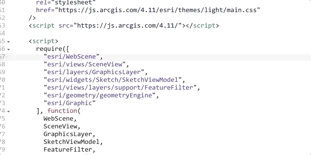

# Contenidos y enlaces del Webinar de Javascript y Python

## Presentación

[Presentación en PDF](webinar_js_python_2019.pdf)

## Contexto

- [StackOverflow survey](https://insights.stackoverflow.com/survey/2018#technology)
- [Modules Count](http://www.modulecounts.com/)

- [Longevity or lack thereof in Javascript Frameworks](https://www.bitovi.com/blog/longevity-or-lack-thereof-in-javascript-frameworks)
- [The cost of Javascript](https://medium.com/@addyosmani/the-cost-of-javascript-in-2018-7d8950fbb5d4)
- [Brian Holt - 10KB or Bust: The Delicate Power of Webpack and Babel - jsday 2018](https://www.youtube.com/watch?v=SSymzmnk0ZA)

## Mejoras para desarrolladores

- Accede directamente a la documentación de un módulo desde el Sandbox.

## Javascript

- [What's New in ArcGIS API 4.11 for JavaScript (March 2019)](https://www.esri.com/arcgis-blog/?post_type=blog&p=465642)

- [Code Snippets](https://github.com/RalucaNicola/code-snippets-arcgis-api-js)

- [Web programming for cartographers — beyond the basics](https://medium.com/@ralucagnicola/web-programming-for-cartographers-beyond-the-basics-cecac632551a)

- [Create powerful popups in web apps with Arcade feature sets](https://www.esri.com/arcgis-blog/products/mapping/mapping/create-powerful-popups-in-web-apps-with-arcade-feature-sets/)

- [Create custom Layers with ArcGIS JS API](https://github.com/jwasilgeo/presentations/tree/master/2019/arcgis-api-for-javascript-creating-custom-layers-and-layer-views)

- [From Javascript to TypeScript](https://youtu.be/WkBvLWt4Ehc?t=388)

## Python

- [Python API](https://github.com/Esri/arcgis-python-api)

- [Python API Labs](https://github.com/Esri/arcgis-python-api/tree/master/labs)

- [Python API - Ejemplos](https://github.com/Esri/arcgis-python-api/tree/master/samples)

- [ArcGIS Notebooks](https://www.esri.com/arcgis-blog/products/arcgis-enterprise/analytics/introducing-arcgis-notebooks/)

- [StoryMaps with Python API](https://github.com/ezhatcher/DCRA/blob/master/Iteratively%20Create%20Storymaps.ipynb)

- [CIM Spec](https://github.com/esri/cim-spec)
- [CIM in Action from ArcGIS Pro](https://youtu.be/8wgt8bKD0Ww?t=85)

- [Webhooks](https://youtu.be/UKSMZes7SeE?t=231)

- [REST How-To webhooks](https://developers.arcgis.com/rest/users-groups-and-items/webhooks.htm)

- [Portal Curator Bot - Webhook Example](https://github.com/Esri/conferences_resources/tree/master/DevSummit2019/webhooks/portal_curator_bot)

- [Geoprocessing Tools - Best practices - Debugging - Video](https://www.youtube.com/watch?v=y84onLbW-_M&list=PLaPDDLTCmy4Y0GMTl0O4V6LF3EmxIAivv&index=39)

- [Geoprocessing Tools - Best Practices - Debugging - Repo](https://github.com/dWynne1/ds19-building-tools)

- [Geoprocessing Rest Services Spec](http://enterprise.arcgis.com/en/server/latest/publish-services/linux/introduction-to-geoprocessing-rest-services.htm)
